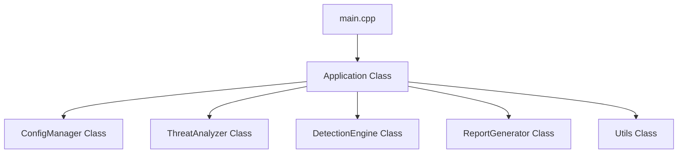

# Keylogger for Security Research - Codebase & Developer Guide

## 1. Codebase Overview

This document provides a technical walkthrough of the C++ codebase for **Keylogger for Security Research**. The application is designed to run in a secure, isolated console context, serving as an interactive threat taxonomy, educational platform, and defensive blueprint analyzer.

### System Directory Layout

```
Keylogger/
├── CMakeLists.txt              # Root CMake build configuration
├── LICENSE                     # MIT License & Ethical Disclaimer
├── README.md                   # Core user documentation & quick-start
├── build.bat                   # Visual Studio/CMake auto-detection & build script
├── run.bat                     # Run-time execution manager
├── config.ini                  # Application configuration file
│
├── docs/                       # Academic & Technical documentation
│   ├── architecture.md         # Windows Keyboard Subsystem analysis
│   ├── developer_guide.md      # [THIS FILE] C++ Codebase & Design patterns
│   ├── ethics.md               # Ethical safeguards & non-malware guarantee
│   ├── future_scope.md         # Technical roadmap (ETW, YARA, GUI)
│   ├── literature_review.md    # Input security academic synthesis
│   ├── methodology.md          # Research process & data flow modeling
│   └── testing.md              # Test protocols & static audits
│
├── include/                    # C++ Header declarations
│   ├── application.h           # Main loop, menu UI, and log writer
│   ├── analyzer.h              # Threat data structures & taxonomy static lookups
│   ├── detector.h              # Defensive concept metadata & logging
│   ├── report.h                # TXT report builder & output writer
│   ├── config.h                # INI reader, default loader, & safe modifier
│   └── utils.h                 # Win32 CLI color formatting & file system helpers
│
└── src/                        # C++ Implementation source code
    ├── main.cpp                # App entrypoint
    ├── application.cpp         # Orchestrator & interactive menu loops
    ├── analyzer.cpp            # Threat intelligence database & comparisons
    ├── detector.cpp            # Defensive technical blueprints & placeholders
    ├── report.cpp              # Document styling and file writer
    ├── config.cpp              # INI parser & defensive guardrail enforcer
    └── utils.cpp               # Console output coloring & timestamp utility
```

---

## 2. Core Class Architecture & Code Flow

The application follows a clean Object-Oriented Design (OOD) with strict separation of concerns.

### 2.1 Dependency Map



### 2.2 Classes Detail

#### `Application` ([include/application.h](file:///c:/DEV/Aman/Keylogger/include/application.h))
- **Role**: Coordinates the lifecycle of the entire tool.
- **Key Methods**:
  - `Initialize()`: Instantiates managers, loads config options, and configures console settings.
  - `Run()`: Triggers the main loop, processes interactive user input, and handles exceptions.
  - `LogEvent()`: Appends status entries (e.g., menu selection, report generation) to a local runtime diagnostics log (`app_events.log`).

#### `ConfigManager` ([include/config.h](file:///c:/DEV/Aman/Keylogger/include/config.h))
- **Role**: Parses config keys, loads default states, and enforces defensive parameters.
- **Key Methods**:
  - `LoadConfig()`: Safely reads `config.ini` from disk. If missing, it writes a default INI file containing standard parameters.
  - `SaveConfig()`: Serializes config data back to disk.
  - `SetSetting()`: Guards dynamic modifications. If an external process attempts to set `KeystrokeLoggingEnabled` to `true`, the application intercepts it and forces it back to `false` with a security warning.

#### `ThreatAnalyzer` ([include/analyzer.h](file:///c:/DEV/Aman/Keylogger/include/analyzer.h))
- **Role**: Static database of academic knowledge on input observation techniques, case studies, and mitigation taxonomies.
- **Key Methods**:
  - `DisplayWhatIsKeylogger()`: Renders theoretical analysis of keystroke harvesting.
  - `DisplayComparativeBreakdown()`: Renders structured table-like comparisons between software, hardware, and kernel keylogger sub-types.
  - `DisplayInputSubsystemDiagram()`: Generates ASCII architecture flows representing Windows input interrupts.

#### `DetectionEngine` ([include/detector.h](file:///c:/DEV/Aman/Keylogger/include/detector.h))
- **Role**: Maintains academic blueprints of modern endpoint protection strategies.
- **Key Methods**:
  - `DisplayAllDetectionTechniques()`: Prints technical code blueprints for Process Memory Scanning, Authenticode signature checks, ETW processes, and autostart registry hooks.

#### `ReportGenerator` ([include/report.h](file:///c:/DEV/Aman/Keylogger/include/report.h))
- **Role**: Combines static data tables, research notes, and defensive recommendations into a beautifully structured, timestamped research report.
- **Key Methods**:
  - `Generate()`: Serializes academic reports to the designated output folder (default: `reports/`).

---

## 3. Strict Safety Safeguards & Ethical Enforcement

To prevent the software from being flagged as a malicious tool or classified as dual-use software, the codebase incorporates compile-time and runtime security guardrails:

> [!IMPORTANT]
> **Hardcoded Guardrail**: The codebase contains **no** low-level Windows hook routines (`SetWindowsHookEx`), poll loops (`GetAsyncKeyState`), or virtual keyboard state readers. 

1. **State Isolation**: The setting `KeystrokeLoggingEnabled` is explicitly monitored. Even if changed in `config.ini`, the parser forces the value to `false`.
2. **Foreground Console Execution**: The program does not hide its window or execute in the background. It is a strictly interactive CLI application.
3. **No Network Layer**: The tool lacks any sockets (`winsock.h`), curl commands, or networking libraries. Exfiltration of compiled data is physically impossible.

---

## 4. Build Scripts & Automation Logic

The repository provides two utility scripts to build and run the application without requiring IDE configuration:

### `build.bat` ([build.bat](file:///c:/DEV/Aman/Keylogger/build.bat))
- **CMake Auto-Detection**: Searches for standard CMake binaries on the system path. If not found, it traverses standard Visual Studio install paths:
  - `C:\Program Files\Microsoft Visual Studio\2022\Community\Common7\IDE\CommonExtensions\Microsoft\CMake\CMake\bin\cmake.exe`
  - Professional/Enterprise installation paths.
  - Legacy Visual Studio 2019 directories.
- **Build Sequence**: Runs CMake configuration (`-B build -S .`) and compiles in `Release` configuration.

### `run.bat` ([run.bat](file:///c:/DEV/Aman/Keylogger/run.bat))
- **Pre-execution Verification**: Checks if the target binary (`build\Release\KeyloggerSecurityResearch.exe`) already exists.
- **Fallback Compilation**: If the target executable is missing, it calls `build.bat` first, ensuring a seamless, single-click launch experience.
